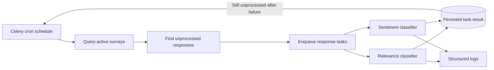

**Estimated effort: ~35–45 hours** (supported by the implementation scope across 21 changed files, multiple review rounds from October 23 through November 17, 2025, staging and limited-production rollout tickets, and follow-up operational requests)

## Project Overview

During my Swayable internship, I worked on production automation for classifying qualitative survey responses by sentiment and relevance. The underlying classifiers already existed, and an earlier branch had begun exploring scheduled execution. My responsibility was not to claim a new classification idea, but to inherit that work and harden it into an operationally safe pipeline. The central engineering question was how to run NLP classification continuously against incoming responses without duplicating work, losing failed items, or making the production queue difficult to control.

The project was tracked primarily through ENG-1268, with related policy and rollout work in ENG-1269, ENG-1270, ENG-1272, and ENG-1273. Operational requests in ENG-1384, ENG-1400, and ENG-1747 provided evidence that sentiment and relevance outputs were needed for real result-delivery and demonstration workflows. I implemented the main change in `swayable-data` pull request #2745, which merged on November 17, 2025 with 21 files changed and 633 additions and 70 deletions.

The completed design used a stateless cron schedule managed through Celery. On each cycle, the scheduler queried for unprocessed responses associated with active surveys and placed individual sentiment and relevance jobs onto the task queue. A task checked whether its response had already received the relevant preprocessing result before running. If processing failed, the error was logged and the response remained eligible for discovery on a later cycle. This made retry behavior a consequence of durable database state rather than dependence on an in-memory list.

This distinction was important. The scheduled job did not itself perform all NLP work in one long process. It discovered eligible work and delegated response-level units to Celery workers. The database represented which responses still required processing, while configuration allowed the feature to be constrained or disabled during rollout. The result was a batch-classification pipeline designed around idempotence, observability, and controlled production exposure.

## Technical Approach

The architecture separated periodic discovery, asynchronous execution, classifier logic, and persistence:



I treated the scheduler as a stateless coordinator. It could run repeatedly because eligibility came from persisted processing state. The following sanitized pseudocode illustrates the discovery boundary; names and values are generalized and contain no customer data:

```python
def schedule_open_text_classification():
    for survey in find_active_surveys(limit=config.survey_limit):
        responses = find_unprocessed_responses(
            survey_id=survey.id,
            limit=config.response_limit,
        )
        for response in responses:
            enqueue("classify_relevance", response.id)
            enqueue("classify_sentiment", response.id)
```

Response-level tasks guarded against repeat classification. This complemented the scheduler query because a response could be encountered more than once across overlapping cron cycles or delayed queue execution:

```python
def classify_if_needed(response_id, task_name):
    response = load_response(response_id)
    if task_name in response.completed_preprocessing:
        return "already_processed"
    result = run_classifier(response.text)
    save_preprocessing_result(response_id, task_name, result)
    return "processed"
```

The retry policy intentionally left failed responses discoverable. The task logged enough context for support while allowing later work to continue. A subsequent cron cycle could then pick the response up again:

```python
try:
    classify_if_needed(response_id, task_name)
except RecoverableClassificationError as error:
    log_error(
        event="classification_failed",
        response_id=response_id,
        task=task_name,
        reason=error.category,
    )
    return  # durable state remains unprocessed for the next cycle
```

Configuration was another part of the technical design rather than an afterthought. Review discussion specifically focused on configuration safety, environment variables, defaults, and the ability to turn the feature off in production. A generalized configuration sketch is:

```python
class ClassificationSchedule:
    enabled = env_bool("CLASSIFICATION_ENABLED", default=False)
    interval = env_duration("CLASSIFICATION_INTERVAL")
    survey_limit = env_int("CLASSIFICATION_SURVEY_LIMIT")
    response_limit = env_int("CLASSIFICATION_RESPONSE_LIMIT")

    def validate(self):
        require_positive(self.interval, self.survey_limit, self.response_limit)
```

The pull request also added operational runbook utilities and a filter test. These supported inspection and controlled cleanup without embedding ad hoc database operations in the main scheduler. The overall implementation touched task registration, application setup, classification task configuration, DAO access, classifier preprocessing exclusions, exception handling, tests, and utilities. This breadth reflected the integration work necessary to move an existing NLP capability into a supportable scheduled service.

## MSHLT Learning Outcomes

**Code quality.** I improved maintainability by separating configuration, scheduling, response-level tasks, and classifier behavior. Pull request review required simplification, removal of unused and commented code, resolution of TODOs, correction of an import, and tests for new behavior. Later review also addressed naming, environment-variable conventions, and safer configuration defaults. Responding to these rounds taught me that production code quality includes operational clarity and reversible controls, not only correct classifier output.

**HLT algorithms and concepts.** The application domain was human language technology because the jobs assigned sentiment and relevance labels to open-ended responses. I learned to view an NLP model as one component in a larger inference system. Selection of unprocessed text, idempotent preprocessing markers, failure handling, and finalization policy determine whether language annotations are complete and trustworthy. The work also reinforced the distinction between model-level behavior and pipeline-level guarantees: a classifier can be accurate for one input while the production system still fails if records are skipped, duplicated, or left unobservable.

**Tools and libraries.** I gained practical experience with Python, Celery task queues and cron-style scheduling, MongoDB-backed processing state, environment-based configuration, application task registration, logging, and automated tests. I also used GitHub pull requests as an engineering record and Linear tickets to connect implementation, queue policy, deployment, and support work. The staged rollout requirements exposed me to operational tools and log inspection as part of validation.

**Professional skills.** I inherited partially developed work, reconstructed its intent, documented decisions, and invited review from engineers familiar with the original approach. I had to communicate queue and finalization policies precisely enough that others could reason about retries and completion. The review history demonstrates sustained iteration: I incorporated requests from several reviewers, reconciled safety concerns, and carried the change to approval and merge rather than treating the first working version as complete.

## Challenges and Solutions

The documented challenge was turning inherited prototype work into production-ready behavior. ENG-1268 explicitly asked for obsolete work to be removed, logging to standard output, a documented queue policy, and a well-enumerated retry policy. I addressed this by making cron runs stateless, querying unprocessed records, recording what was being processed, and allowing failures to remain eligible for a later cycle.

A second documented challenge was configuration safety. Review comments raised concerns about how the configuration object worked, test configuration, environment-variable use, naming, and production defaults. The final approval acknowledged that the behavior might still require observation but emphasized that it could be turned off in production and overridden through environment configuration. I therefore treated kill-switch and scope controls as core parts of production readiness.

A third challenge was code readiness under review. The first formal review requested simpler code, removal of dead material, corrected imports, resolved TODOs, and additional testing. Subsequent comments show that the implementation improved across multiple commits before approvals. The records support a solution based on review-driven refinement; they do not support claiming that the initial inherited approach was production-ready.

The rollout itself was also deliberately constrained. ENG-1269 required staging tests with one survey and multiple surveys, while ENG-1270 required a small production scope, queue drain and retry checks, and supportable logging. These tickets document an incremental validation strategy instead of an immediate unrestricted launch.

## Outcomes and Impact

Pull request #2745 merged into the production repository on November 17, 2025. It established cron-based discovery and Celery execution for sentiment and relevance classification, together with explicit retry and duplicate-avoidance behavior. The related queue-policy, finalization-policy, staging, and limited-production tickets were completed.

The work also supported practical organizational needs. ENG-1384 and ENG-1400 concerned running tagging and enabling AI summaries for launched survey work, while ENG-1747 requested sentiment and relevance processing for a demonstration. I do not infer volumes, speedups, model-quality gains, or business metrics from those records. What the evidence supports is that the classification capability was connected to workflows that needed qualitative outputs and that the merged automation reduced reliance on an entirely manual execution path.

Operationally, the largest impact was a supportable execution model. Already processed responses could be ignored, failures remained retryable, work was visible in logs, and production behavior could be limited through configuration. Those properties made an existing language-processing capability safer to run repeatedly.

## Professional Practice and Reflection

This project changed how I evaluate an NLP system. Before this work, it was easy to focus on the classifier and regard scheduling as infrastructure around it. In production, however, annotation completeness, idempotence, and recovery are part of the effective quality of the system. A label that is never generated because a task disappeared is as unavailable to a user as a model that cannot classify the text.

I also learned the value of explicit decision records. ENG-1272 required the team to state how responses enter the queue, how cron discovers them, how retries occur, and how processed responses are excluded. Writing these rules down made review more concrete and reduced ambiguity for future operators. Similarly, the finalization discussion in ENG-1273 showed that “finished” is a product concept as well as a database state: qualitative processing must be accounted for when stakeholders expect a survey to have no further work pending.

Finally, I learned that hardening inherited work requires respect for both prior reasoning and current constraints. I did not need to invent a different scheduling concept merely to make the contribution my own. The stronger contribution was to understand the earlier approach, remove obsolete elements, add controls and tests, respond carefully to review, and make the system suitable for monitored use.

## Code Reference

**Merged production code:** `swayable/swayable-data` pull request #2745, “feat: cron based sentiment and relevance,” merged November 17, 2025. The change included 21 files with 633 additions and 70 deletions. Relevant areas included `swayable_data/app/openend_classification_task_config.py`, `swayable_data/app/tasks/analysis.py`, `swayable_data/app/tasks/quals.py`, qualitative sentiment and relevance preprocessing modules, DAO integration, tests, and runbook utilities.

**Inherited prototype context:** ENG-1268 and the pull request description identify earlier work as the starting point. My portfolio claim is the hardening, integration, operational policy, review iteration, and production-readiness work represented by #2745, not authorship of the original cron concept.
