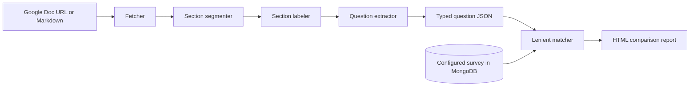

**Estimated effort: ~40–50 hours** (supported by two multi-week Linear tickets, a 30-file prototype with more than 2,000 added lines across successive pull requests, a comparison harness, fixtures, documentation, tests, branch recovery, and formal review)

## Project Overview

I developed an information-extraction prototype for Swayable’s proposed “autoprogram” workflow. Survey test designs were authored collaboratively in Google Docs, but programming the resulting questions into the survey platform required a person to interpret the document and re-enter structured fields. COR-323 asked me to define the end-to-end prototype shape: entry point, input format, output format, validation method, and shared assumptions for later extraction tasks. COR-361 then asked for a prototype that extracted questions and validated them against configured survey objects in MongoDB.

The prototype accepted either a Google Doc URL or an exported Markdown file. It segmented the document into recognizable sections, labeled sections such as breakdowns and metrics, parsed question-bearing table rows, inferred question types, extracted stems and answer choices, and emitted structured JSON shaped for downstream survey programming. A separate comparison tool aligned extracted questions with historical configured surveys and rendered an HTML report for inspection.

This was explicitly research and proof-of-concept work. Pull requests #3048, #3066, #3067, and #3074 were all closed without merge. Pull request #3048 recorded 30 changed files and 2,045 additions; later versions carried roughly the same prototype while branches and ticket scope were corrected. The final formal review called the work a good proof of concept and praised the evaluation harness, but considered the regular-expression approach brittle for messy human prose. The reviewer recommended exploring LLM structured output and moving prototype code out of the production repository into a standalone cloud function. I therefore describe this entry as a prototype and do not imply that its code shipped.

The project’s main technical value was not a production parser. It was an executable investigation of how semi-structured planning documents could become typed survey data, plus a validation framework that made competing extraction approaches measurable.

## Technical Approach

The prototype decomposed document understanding into explicit stages:



The fetcher separated network access from local fixture processing. This allowed the same pipeline to run interactively against a document or deterministically against sanitized test files:

```python
def load_design(source):
    if source.is_document_url():
        return export_as_markdown(source.document_id)
    if source.is_local_markdown():
        return read_text(source.path)
    raise UnsupportedInput()
```

The segmenter scanned Markdown tables for section boundaries, and the labeler mapped normalized headers into semantic categories. The actual implementation used pattern matching, but this generalized example shows the intended intermediate representation:

```python
def label_section(header):
    text = normalize(header)
    if contains_any(text, ["breakdown", "segment", "audience question"]):
        return "questions"
    if contains_any(text, ["metric", "outcome"]):
        return "metrics"
    if contains_any(text, ["filter", "screen"]):
        return "filters"
    return "unknown"
```

Question extraction combined Markdown cleanup, instruction handling, question-stem detection, choice parsing, and type inference. Documents could contain leading directives, emoji markers, inline choices, continuation rows, format hints, strikethrough exclusions, or colon-terminated prompts. A sanitized illustrative parser is:

```python
def parse_question(row):
    if row.is_struck_through():
        return None

    text = strip_markdown(row.primary_cell)
    directive, body = remove_leading_instruction(text)
    stem, inline_choices = split_stem_and_choices(body)
    choices = inline_choices + parse_continuation_options(row)

    return QuestionDraft(
        text=stem,
        kind=infer_type(directive, body, choices),
        choices=choices,
    )
```

Type inference used observable signals rather than pretending that every document followed one schema. A single-select marker suggested one choice; “select all that apply” and corresponding markers suggested multi-select; arrows or agreement anchors suggested a scale; and otherwise the parser fell back to open text:

```python
def infer_type(directive, text, choices):
    if signals_multi_select(directive, text):
        return "multi_select"
    if signals_single_select(directive, text) or choices:
        return "single_select"
    if signals_scale(text):
        return "scale"
    return "open_text"
```

Validation was intentionally lenient because planning documents represented intent, while configured surveys could contain small editorial differences. Exact string equality would classify harmless wording changes as failures. The matcher therefore normalized text and accepted strong prefix or token-overlap evidence:

```python
def likely_same_question(extracted, configured):
    left = normalize(extracted.text)
    right = normalize(configured.text)
    return (
        left == right
        or shared_prefix(left, right) >= PREFIX_THRESHOLD
        or token_overlap(left, right) >= OVERLAP_THRESHOLD
    )
```

This scoring was useful for rapid prototype evaluation, but it was not a proof of semantic equivalence. A lenient matcher can hide meaningful differences if thresholds are too permissive. For that reason, the pipeline rendered side-by-side HTML results for human inspection rather than treating a numerical match rate as sufficient production validation.

The code was organized as a service package with fetcher, segmenter, labeler, schema, question extractor, comparison tool, command-line entry point, documentation, fixtures, and tests. Review-driven refactoring consolidated duplicated `run_pipeline` logic, corrected serialization so continuation-row options were included, and moved environment loading and database configuration out of module import time. Metadata and dependency extraction remained explicit post-MVP stubs, which kept the prototype boundary visible.

## MSHLT Learning Outcomes

**Code quality.** I practiced decomposing an experimental NLP pipeline into testable stages with typed intermediate data. The package boundary separated acquisition, structural analysis, extraction, serialization, and evaluation. I added local fixtures and unit tests, documented command-line use, and refactored duplicated pipeline entry points. I also learned that code can be internally organized and still be inappropriate for a production repository when its algorithm and deployment boundary remain experimental.

**HLT algorithms and concepts.** This project applied information extraction to semi-structured human-authored documents. I worked with normalization, segmentation, weak structural cues, rule-based classification, schema mapping, and approximate matching. The task demonstrated why natural-language variability resists brittle rules: the same question intent could be represented with directives, punctuation, symbols, table continuations, multilingual phrasing, or editorial differences. Review feedback identified the fixed output schema and messy input prose as a strong candidate for LLM structured output, giving me a concrete basis for comparing deterministic patterns with learned language understanding.

**Tools and libraries.** I used Python modules, dataclasses, regular expressions, Markdown exports, a command-line interface, Google Doc fetching, MongoDB survey retrieval, HTML report generation, and automated tests. GitHub supported iterative pull requests and review, while Linear defined prototype acceptance criteria and ticket relationships. The historical-document harness also taught me to design evaluation tooling around representative fixtures while protecting customer information in public descriptions.

**Professional skills.** I translated an ambiguous automation goal into a bounded prototype with documented inputs, outputs, and validation. I separated what the experiment demonstrated from what it did not prove. I also responded to branch and ticket-scope issues across several closed pull requests, corrected the implementation’s relationship to COR-323 and COR-361, and accepted architectural feedback that the next iteration should use a different extraction method and repository boundary.

## Challenges and Solutions

The first documented challenge was defining the prototype before dependent extraction work could proceed. COR-323 required decisions about the CLI or other entry point, Google Doc or exported input, output shape, and comparison with MongoDB. I addressed this with a command-line pipeline, Markdown as a practical intermediate format, typed JSON output, and a batch comparison harness.

The second challenge was variability in the planning documents. Pull request descriptions document instruction preambles, trailing format hints, “select all” exceptions, emoji-based type cues, inline and space-separated choices, colon-terminated stems, continuation-row options, multilingual examples, and strikethrough exclusions. I added focused parsing rules and fixtures for these observed formats. The solution expanded coverage for the prototype, but the later review correctly identified the accumulating regex logic as brittle.

The third challenge was evaluating extraction when source and configured question text were not always identical. The documented solution was lenient matching based on prefixes and word overlap, paired with a side-by-side HTML report. The pull request body recorded a perfect match result on its historical fixture set, but because all related pull requests were unmerged and the matcher was intentionally lenient, I do not present that figure as a production accuracy metric. It was a prototype result used to inspect behavior.

The fourth challenge came from formal review rather than runtime evidence. Pull request #3074 received a changes-requested review stating that an LLM with structured output should be explored and that prototype-level code should live outside the production repository. The recommended solution was to close the pull request, complete the prototype ticket, and translate the experiment into a standalone cloud-function effort. Records support that architectural direction; they do not show a merged LLM replacement within this work.

Finally, the pull request history included branch restoration and ticket-reference corrections. One review comment also noted failing checks and questioned whether COR-361 was the correct implementation ticket. I corrected the linkage in later pull requests. This reinforced that repository hygiene and traceability matter even for experiments.

## Outcomes and Impact

The prototype demonstrated a complete research path from a planning document to structured question objects and from those objects to comparison against configured surveys. It created reusable concepts for input acquisition, section labeling, question serialization, and evaluation. COR-323 and COR-361 were marked complete, indicating that the prototype and question-extraction investigation fulfilled their research purpose.

The evaluation harness was the clearest durable outcome. The formal reviewer specifically described it as valuable because it could protect future iterations while the extraction method changed. That observation matters more than claiming the regex implementation was ready to deploy. A later LLM-based extractor could be assessed against the same broad workflow: process historical documents, align outputs to configured survey data, and inspect disagreements.

No code from pull requests #3048, #3066, #3067, or #3074 merged. I therefore do not claim production adoption, time savings, reduced error rates, or customer impact. The impact supported by the record is technical learning, de-risking, and a concrete architectural recommendation for the next phase.

## Professional Practice and Reflection

This work taught me that a successful prototype can reveal why its own implementation should not ship. The regex parser was useful because it forced the team to enumerate document signals and output requirements. As each exception appeared, however, it became clearer that local parsing rules were approximating language understanding. The review recommendation for LLM structured output was not a rejection of the investigation; it was a conclusion enabled by the investigation.

I also learned to treat evaluation design as part of HLT system design. Exact matching was too strict for edited survey text, while lenient overlap could be too forgiving. The appropriate prototype response was to expose both an aggregate indication and inspectable pairs. A future production evaluation would need explicit error categories, held-out documents, threshold calibration, schema-level validation, and safeguards for unsupported fields such as dependencies.

The repository decision was equally important. Isolation in a service package reduced coupling, but it did not answer whether experimental code belonged in the main production repository. Professional engineering includes choosing an appropriate deployment and ownership boundary. Closing the pull request instead of forcing a merge preserved that distinction.

Finally, I became more precise about communicating status. “Ticket complete” meant the research objective was completed, not that the software was deployed. “Matched” meant the lenient heuristic aligned a pair, not that semantic correctness had been proven. “Prototype” meant a basis for learning and comparison, not an unfinished production promise.

## Code Reference

**Merged production code:** None. The autoprogram question-extraction implementation was never merged.

**Prototype code:** `swayable/swayable-data` pull requests #3048, #3066, #3067, and #3074 were all closed unmerged. Pull request #3048 contained the core 30-file, 2,045-addition version; later pull requests restored or renamed branches, corrected ticket scope, and continued review. The main prototype areas were `swayable_data/services/autoprogram/`, `bin/autoprogram.py`, Markdown fixtures, serialization tests, and the comparison harness.

**Future direction documented in review:** replace or compare the brittle regex extraction with LLM structured output and place the experiment in a standalone cloud-function repository rather than the production data repository.
