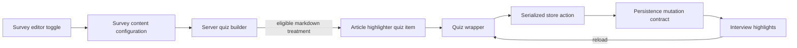

**Estimated effort: ~45–55 hours.**

## Project Overview

During my Swayable internship, I implemented major layers of an Article Highlighter collection feature across the private `ui` and `swaypi` repositories. The work covered tickets COR-420 through COR-424, COR-427, and COR-550 and was merged through seven pull requests: `ui` #2357, #2358, #2370, and #2382, plus `swaypi` #1756, #1758, and #1759. The feature allows an authorized survey editor to configure collection for an eligible article, causes the API to append a corresponding item to the respondent quiz, and connects respondent-created highlights and comments to the quiz state and persistence interface.

My contribution was full-stack, but it was not the entire feature. I owned the configuration, schema, quiz-generation, and quiz-store integration described here. The persistence mutation for saving a highlight was implemented under COR-425 by another contributor, and some of the presentational selection and commenting interface was also completed by others. I integrated with those contracts rather than claiming authorship of them. This distinction was important in a collaborative product codebase because the delivered experience depended on coordinated work across multiple pull requests and engineers.

The MSHLT relevance is adjacent to language technology rather than model training. A highlight is a human span annotation over article text, represented by character offsets and associated metadata such as sentiment and an optional comment. The feature therefore creates structured human-language data that could support later qualitative analysis, annotation review, or research workflows. I did not train, evaluate, or deploy a machine-learning model as part of this work.

The implementation had four connected goals:

1. Add a durable survey configuration field and expose it through authorization and GraphQL.
2. Show a safe editor control only when the survey and alpha feature gate permit it.
3. Generate the correct respondent quiz item only for eligible treatments.
4. Read, optimistically update, serialize, and persist highlight saves without breaking quiz navigation.

## Technical Approach

I treated the feature as a vertical data path rather than as an isolated component. Configuration begins in the survey editor, passes through the persisted survey schema, affects server-side quiz construction, and finally activates a client-side wrapper and store action for the respondent.



### Configuration and schema

In `swaypi` #1756, I added an optional `enableArticleHighlighter` Boolean to the survey content configuration. The change synchronized the application schema, database JSON validator, authorization map, and generated GraphQL surface. I followed the existing engagement configuration pattern so the field behaved consistently with nearby product capabilities.

In `ui` #2357, I added the survey-editor control and connected it to the content configuration. Eligibility required at least one non-placebo markdown treatment. That rule prevented the editor from enabling a text-span interaction for video, image, or placebo-only content. In #2358, I addressed a subtler state problem: a control hidden immediately after its qualifying content is removed can strand a previously enabled value. The visibility rule therefore keeps an enabled control reachable so an editor can clear it.

Illustrative, sanitized logic:

```javascript
function shouldShowCollectionToggle({ hasEligibleArticle, isEnabled, alphaFlag }) {
  return alphaFlag && (hasEligibleArticle || isEnabled)
}
```

The alpha gate in `ui` #2382 deliberately wrapped one editor touch point. No organization was enabled by default. This minimized the removal cost at general availability and prevented an incomplete workflow from being exposed while dependent work was still releasing.

### Annotation schema

In `swaypi` #1758, I added the interview-level schema for article highlights. Each record contained a client-generated identifier, integer `start` and `stop` offsets, highlighted text, sentiment, and an optional comment. I also added a separate content reference for data lineage. Character offsets had to be nonnegative integers, and `stop` had to be greater than `start`; an empty or reversed interval is not a meaningful span.

Sanitized schema pseudocode:

```text
ArticleHighlight:
  id: required string
  start: required integer, start >= 0
  stop: required integer, stop > start
  highlightedText: required string
  sentiment: one of [positive, negative]
  comment: optional string
```

This representation is directly related to human language annotation. The offsets define a span over source text, while the metadata records a respondent judgment. The work required precision around text indexing and validation, but it did not include tokenization, linguistic model inference, or model training.

### Quiz generation

In `swaypi` #1759, I added the `articleHighlighter` item type and extended the shared survey-to-quiz path. When collection was enabled and the assigned treatment was a non-placebo markdown article, the server appended a highlighter page referencing that same treatment. I reused the existing content-page builder and changed the emitted item type instead of creating a parallel rendering pipeline. Preview quizzes inherited the behavior through the shared conversion path.

```text
if configuration enables highlighting
   and assigned treatment is markdown
   and assigned treatment is not placebo:
       append content page with itemType = articleHighlighter
```

The placebo exclusion is methodologically important. Character offsets into a treatment article do not carry the intended analytical meaning for a control condition. Tests covered enabled and disabled states, markdown and non-markdown treatments, placebo exclusion, preview behavior, and coexistence with engagement collection.

### Quiz and store integration

In `ui` #2370, I connected the new item type to the respondent quiz. The wrapper supplied article markdown and existing highlights to the presentational component, normalized emitted saves to the declared API fields, and forwarded progress state to the quiz navigation gate. The store selected saved highlights when loading an interview and sent new saves through its existing serial execution queue.

I used a last-write-wins upsert keyed by a client-generated highlight identifier. The same operation supported initial creation and later comment updates:

```javascript
function upsertHighlight(current, incoming) {
  const index = current.findIndex(item => item.id === incoming.id)
  if (index < 0) return [...current, incoming]
  return current.map((item, i) => i === index ? { ...item, ...incoming } : item)
}
```

The client allowed only declared input fields through to the mutation. This mattered because rehydrated GraphQL objects can contain transport metadata such as `__typename`; sending an undeclared field caused the API to reject the mutation and could stall later work behind the serial queue. The wrapper therefore acted as a contract boundary rather than forwarding arbitrary component state.

Continue and submission behavior also required state-machine reasoning. A respondent could not advance through an unfinished article page, but a respondent who had already moved past that page could not be trapped after reload merely because the session-local scroll-completion signal was absent. I folded the first unfinished article page at or ahead of the current page into the store's maximum reachable-page calculation and covered the behavior with a new live-store unit-test harness.

## MSHLT Learning Outcomes

### 1. Code

I wrote and reviewed production JavaScript and Vue code spanning schemas, GraphQL selections, authorization configuration, Vue components, composables, stores, constants, and automated tests. The work strengthened my ability to make coordinated changes across frontend and backend repositories while preserving existing patterns. I also practiced writing narrow adapters: the quiz wrapper translated a presentational event into the exact store and API contract without coupling the component to persistence details.

### 2. Algorithms and concepts

The central concepts were interval validation, identifier-keyed upserts, feature gating, serial execution, optimistic state updates, and navigation-state constraints. Span annotations required the invariant `0 <= start < stop` with integer positions. Store updates required deterministic replacement by identifier. Quiz gating required reasoning about current position, unfinished pages, reload behavior, and submission reachability. These are not machine-learning algorithms, but they are directly relevant to building dependable systems that collect human language annotations.

### 3. Tools

I used Git and GitHub pull requests, Linear tickets, Vue test utilities, Vitest-style unit tests, Cypress integration runs, GraphQL tooling, MongoDB/Mongoose schemas, JSON database validators, linting, local preview deployments, and browser-based quality assurance. I also worked with a CI arrangement that paired sibling repository branches by name, which required understanding why a UI test could fail when the matching API schema was unavailable.

### 4. Professional skills

I practiced scope definition, cross-repository dependency management, reviewer communication, evidence-based QA, and accurate attribution. I documented merge order and branch dependencies, responded to feedback about stranded configuration and store gating, and added tests requested during review. I also learned to describe my contribution precisely: I implemented the surrounding configuration, data, generation, and store layers while integrating a persistence mutation and some presentation work owned by teammates.

## Challenges and Solutions

One challenge was preventing invalid editor states. The first content gate correctly hid irrelevant controls, but review identified that it could make an already enabled setting impossible to clear after eligible content was removed. I changed the visibility condition to use qualifying content **or** the existing enabled value and added parameterized tests across the related toggles. The evidence for this solution is in `ui` #2358, which documents the stranded-flag case and its test coverage.

A second challenge was preserving the GraphQL mutation contract. During full-flow QA for `ui` #2370, a rehydrated highlight carrying an unknown metadata field reproduced a rejected save and a blocked serial queue. I fixed this by selecting only declared input fields before dispatch. The PR records the reproduction, the field-stripping change, and tests that verify unknown fields are removed.

A third challenge was navigation after reload. The article completion signal was session-local, whereas quiz page position could survive a reload. Unconditionally restoring the gate could strand a respondent who had already passed the article page and prevent submission. I changed the calculation to consider unfinished article pages at or ahead of the current position and added store tests for normal gating, last-page submission, and the past-page escape.

A fourth challenge was cross-repository CI. The UI branch needed API fields that were present on an integration branch but not yet on API `main`. Review comments on `ui` #2370 document that the quiz end-to-end job became green after CI was given a matching API branch. This was a dependency-resolution issue, not a product-code test bypass.

## Outcomes and Impact

The seven listed pull requests were merged. Together, they established an alpha-controlled path from editor configuration to quiz collection: a persisted and authorized survey setting, schema support for validated annotations, conditional quiz generation, respondent-store integration, reload hydration, and guarded release exposure. Automated evidence included schema tests, component tests, preview and live quiz tests, store tests, lint runs, and CI runs recorded in the pull requests.

I do not claim a measured business, response-rate, or annotation-quality improvement because no such metric was provided by this work. The defensible impact is technical and operational: the feature became configurable, testable, and integrable without exposing the unfinished alpha broadly. Its stored spans and comments provide structured human annotation data for downstream analysis, subject to whatever research design and validation Swayable applies later.

## Professional Practice and Reflection

This project changed how I think about full-stack feature ownership. The visible interface was only one layer. Correctness depended on consistent rules across configuration, authorization, database validation, server quiz generation, client hydration, mutation boundaries, optimistic updates, and navigation. A local decision, such as hiding a toggle or forwarding an object unchanged, could produce a remote failure much later in the flow.

I also learned that language-data collection deserves the same methodological care as language modeling. Span boundaries, treatment identity, placebo handling, comments, and reload behavior all affect whether an annotation remains interpretable. Even without training a model, I was building infrastructure that determines the shape and reliability of human language evidence.

Finally, the review process reinforced the value of explicit limitations. The persistence mutation and parts of the presentation layer were collaborative dependencies. Stating that boundary makes this portfolio entry more accurate and better reflects professional engineering, where successful delivery usually spans multiple owners.

## Code Reference

The source repositories are private, so the snippets above are sanitized illustrations rather than copied proprietary code.

- Swayable `ui`: pull requests #2357 (COR-421), #2358 (COR-422), #2370 (COR-427), and #2382 (COR-550).
- Swayable `swaypi`: pull requests #1756 (COR-420), #1758 (COR-423), and #1759 (COR-424).
- Related collaborative dependency: COR-425 implemented the persistence mutation; some presentational Article Highlighter work was completed by other contributors.
