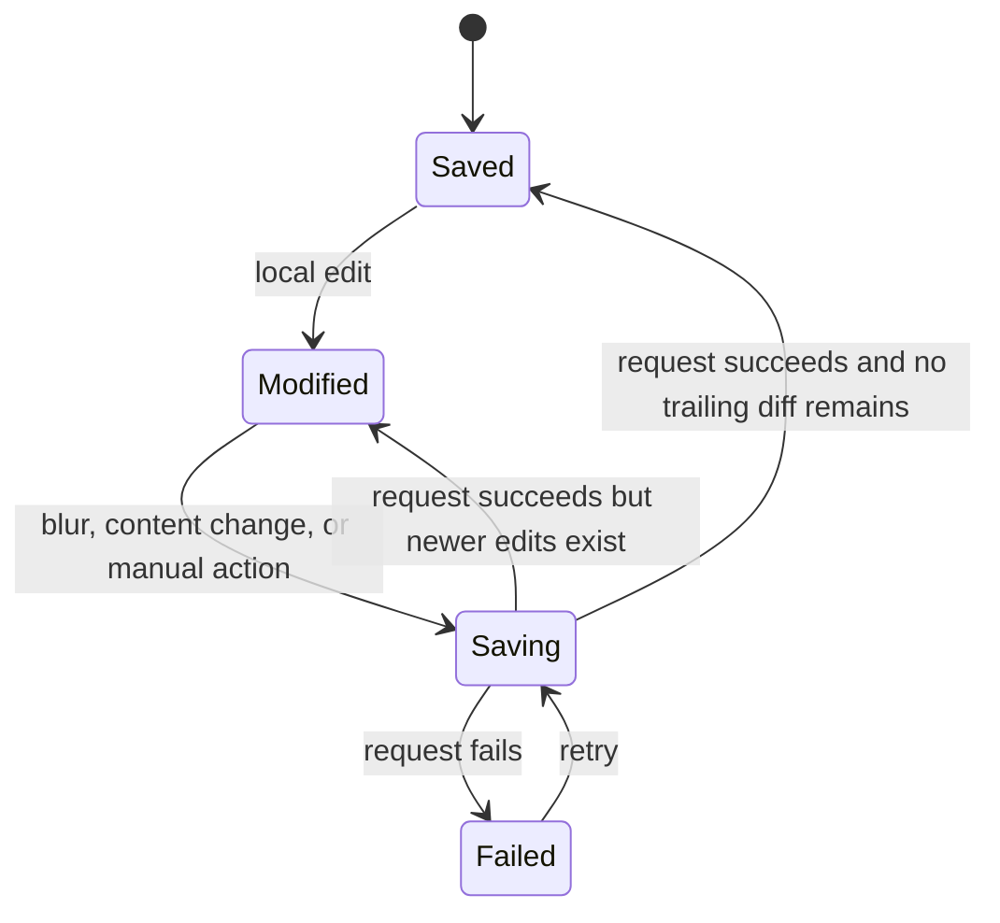

**Estimated effort: ~12–16 hours.**

## Project Overview

For COR-516, I replaced a manual save workflow on Swayable's launch-from-design page with autosave behavior and a unified save-status indicator. The work was merged in the private `ui` repository as pull request #2405 on July 8, 2026. The merged pull request changed ten files with 379 additions and 90 deletions.

The page already had mechanisms for computing a draft diff and sending a save. The engineering problem was not simply to call the mutation more often. I had to choose appropriate triggers, represent user-visible save state, integrate content-title saves that used a separate path, and preserve edits made while a network request was in flight. A naive autosave implementation could report success while dropping a trailing edit or replace local state with an older response.

The delivered design used autosave on field blur, automatic persistence for content-list changes, and a toolbar indicator that displayed `Saving…`, `Saved`, `Modified`, or `Failed to save`. The indicator also functioned as a manual retry or fallback action when there were unsaved changes or a previous save failed. I chose blur rather than general keystroke debounce because prior internal engineering guidance documented debounced configuration and text-field autosave as an undesirable pattern in this product. Blur created a clear transaction boundary while preserving normal multiline text entry.

This entry is primarily workplace software engineering rather than computational linguistics or machine learning. It nevertheless addresses all four MSHLT learning outcomes honestly. The algorithmic content is comparatively thin; the strongest conceptual learning involved asynchronous coordination, state transitions, dirty-state baselines, and preservation of user input under concurrency.

## Technical Approach

I modeled saving as coordination among three forms of state:

- the current editable draft;
- the last server baseline known to correspond to a completed request;
- the status of draft and content-title save operations.



### Preserving in-flight edits

The original workflow refetched after saving. That approach risked replacing the editor with server data corresponding to the request while the user had already made a newer local edit. I removed the post-save refetch and advanced the local baseline to the exact payload that had been sent. The current editable state remained independent.

Sanitized pseudocode:

```javascript
async function saveDraft() {
  const payload = diff(serverBaseline, editableDraft)
  if (isEmpty(payload)) return

  await updateDraft(payload)
  serverBaseline = apply(serverBaseline, payload)

  if (!isEmpty(diff(serverBaseline, editableDraft))) {
    await saveDraft()
  }
}
```

The important detail is that success updates the baseline with `payload`, not with the potentially newer `editableDraft`. Suppose a request sends title A, and the user types title B before that request finishes. Marking title B as saved would be false because the server received only A. Updating the baseline to A leaves a visible diff for B, allowing the flush loop to send the trailing change.

This is a small asynchronous state machine rather than a sophisticated algorithm. Its value lies in preserving an invariant:

```text
serverBaseline represents only values known to have completed successfully.
```

### Save triggers

Text and configuration fields initiated autosave on blur. This reduced unnecessary writes during typing and aligned with an existing content-title behavior. Content additions presented a separate case because adding an item does not necessarily produce a field blur. I connected content-list changes to autosave and retained the status indicator as a manual fallback for modified or failed state.

Inputs were not disabled during saving. A slow request therefore did not block the user from continuing to edit. That interaction choice made the baseline and trailing-diff logic necessary: accepting concurrent local edits is useful only if the workflow can preserve them.

### Unified status and retry

I created a reusable `SaveStatusIndicator` using the shared design-system button. It exposed the workflow state while also emitting a save action when retry or manual save was meaningful. It was disabled during `Saving` and when fully `Saved`, and enabled for `Modified` and `Failed to save`.

Content-title rename used a different save path from the draft record. Rather than coupling the generic content card to the launch-page workflow, I had the card emit a sanitized status contract:

```text
save-status:
  status: pending | success | error
  retry: optional callback for the failed operation
```

The content editor forwarded that event, and the page folded it into the single toolbar indicator. Exposing the retry function was necessary because retrying only the draft save would not recover a failed title mutation. This event-based design kept the content card reusable and let the page coordinate the user experience.

### Verification strategy

I added or updated tests at each affected seam:

- composition tests for baseline advancement without refetch, in-flight edit preservation, and trailing autosave flush;
- page tests for saving, dirty, and error indicator states, save-event handling, blur autosave, and content-rename status;
- component tests for pending, success, and error events and for retrying the same failed title save;
- Cypress launch-flow tests updated to wait for autosave and use the new status behavior.

The pull request records that the full UI unit suite passed with 1,598 tests and two pre-existing skips, and that lint completed cleanly. I report those as verification evidence from the pull request, not as a product-impact metric.

## MSHLT Learning Outcomes

### 1. Code

I implemented production Vue and JavaScript changes across a reusable component, content editor components, a launch-page composition, the page itself, unit tests, and Cypress tests. I learned to separate domain state from user-interface state: draft persistence remained in the launch composition, content title persistence remained in the content card, and the page coordinated both through an event contract. I also used the shared button component after review instead of maintaining an ad hoc control, improving consistency for focus, disabled behavior, color, and explanatory tooltips.

### 2. Algorithms and concepts

This outcome was present but narrower than in a language-processing or data-science project. I did not implement a linguistic algorithm or machine-learning method. The relevant concepts were asynchronous state machines, optimistic interaction design, diff computation, concurrency, idempotent retry expectations, and invariants around acknowledged server state.

The main reasoning problem was equivalent to a single-writer coordination loop: while one request is active, local edits may continue; after completion, the system compares the acknowledged baseline with current state and flushes any remaining difference. I also reasoned about independent operations that share one status surface. A failed title rename must preserve its own retry operation rather than being mistaken for a failed draft save.

### 3. Tools

I used Vue, composable state management, GraphQL mutation workflows, the project's design system, unit-test utilities, Cypress end-to-end tests, linting, Git, GitHub pull-request review, Linear, local development environments, and preview deployments. The testing work required intercepting autosave at the correct time and waiting for automatic mutations rather than clicking a control that was legitimately disabled after a successful save.

### 4. Professional skills

The strongest learning outcomes were professional. I translated a product spike into a mergeable workflow, documented the tradeoff between blur and debounce, provided preview environments and QA paths, and incorporated multiple rounds of review. Review feedback asked me to simplify the implementation, keep the content card generic, retain a manual fallback, and use the shared design-system button. I revised the architecture and tests rather than defending the initial form.

I also documented known staging failures that were unrelated to autosave, separating environmental limitations from regressions in my work. This prevented misleading QA conclusions. The final approval specifically followed those review-driven refinements.

## Challenges and Solutions

The first challenge was a data-clobbering risk during an in-flight request. Pull request #2405 documents that the previous post-save refetch could overwrite edits entered after a request began. I removed the refetch, advanced the baseline to the exact sent value, and added tests showing that a newer local edit remains in the editor.

The second challenge was a dropped trailing update. A save workflow that returns an existing in-flight promise can fail to send values created after that promise began. I added a flush loop that checks for a remaining diff after the active save completes. The composition tests explicitly cover trailing edits.

The third challenge was presenting one truthful status for separate persistence paths. Draft fields and content-title rename did not use the same mutation. An earlier approach could retry the draft while leaving a failed title rename unresolved. I changed the content card to emit both status and the operation-specific retry function, then routed that contract through the page-level indicator. Component and page tests cover pending, success, failure, and retry.

The fourth challenge came from end-to-end test expectations after content autosave was added. Tests initially attempted to click the indicator after adding content, but the automatic content watcher had already persisted the change and moved the indicator to disabled `Saved` state. I corrected the tests to wait for the automatic update request and ensured the network intercept was registered before the action that triggered autosave. This evidence appears in the pull request commit history.

The fifth challenge was balancing custom behavior with the design system. Review identified the hand-built status button as an unnecessary divergence. I replaced it with the shared button primitive and preserved the required disabled reason and destructive error styling. The reviewer approved the final revision after these follow-ups.

## Outcomes and Impact

The merged result changed the launch page from an explicit save-button workflow to autosave with visible, retryable status. Users could continue editing during requests, and the workflow preserved changes made after a request started. Content-title rename and draft saves presented one status surface without merging their underlying responsibilities.

The work also increased automated coverage around a failure-prone interaction boundary. Tests covered state display, blur triggers, content-driven autosave, failed-operation retry, baseline advancement, and trailing-edit flush. The pull request was merged after review and green test and lint evidence.

I do not claim measured time savings, conversion improvement, reduced support volume, or a specific reduction in data loss because the project did not provide those measurements. The supported impact is behavioral: save feedback became visible, failed saves became retryable from the toolbar, and the implementation protected local edits during in-flight requests.

## Professional Practice and Reflection

This project demonstrated that autosave is a data-integrity feature, not merely a convenience. The visible control was small, but its correctness depended on distinguishing local state, acknowledged server state, active requests, and independent mutation paths. The most important implementation decision was to make the baseline represent only what the server was known to have accepted.

I also learned to treat review as architectural input. My first solution contained more workflow coupling and custom interface code. The final design used an emitted status-and-retry contract and a shared design-system primitive. It was smaller in responsibility even though it handled more failure cases correctly.

From an MSHLT perspective, this was not a language-technology artifact. Its relevance is in transferable engineering practice: research and language-data tools also contain editable forms, annotation interfaces, asynchronous persistence, and users who must trust that their work has been saved. Concurrency-safe state management and honest status feedback are essential in those settings even when no NLP algorithm is involved.

## Code Reference

The source repository is private, so the snippets above are sanitized pseudocode.

- Swayable `ui` pull request #2405, COR-516: 379 additions, 90 deletions, ten files.
- Merged July 8, 2026.
- Primary areas: `SaveStatusIndicator`, content-editor status forwarding, launch draft composition, launch page integration, unit tests, and Cypress launch flows.
